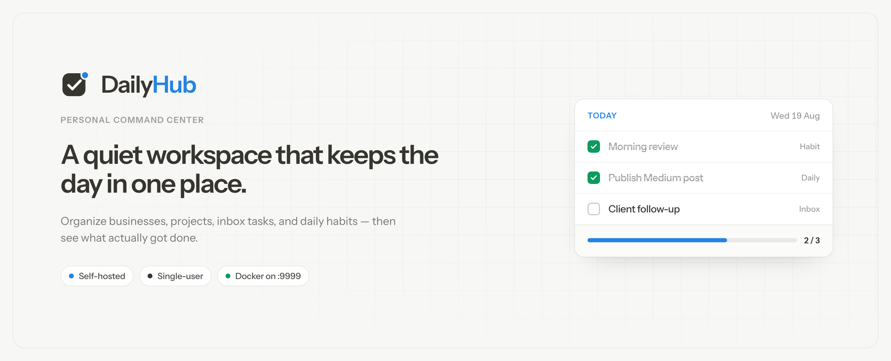

<p align="center">
  
</p>

<p align="center">
  <strong>A personal command center for projects, tasks, and daily habits.</strong><br>
  <sub>Single-user · self-hosted · Next.js 15 · SQLite or PostgreSQL · Docker or npx</sub>
</p>

<p align="center">
  <a href="https://baselhusam.github.io/daily-hub/">Site</a>
  ·
  <a href="https://github.com/baselhusam/daily-hub">Repository</a>
  ·
  <a href="https://www.npmjs.com/package/@baselhusam/daily-hub">npm</a>
  ·
  <a href="docs/DEPLOYMENT.md">Deploy</a>
  ·
  <a href="docs/DESIGN.md">Design</a>
  ·
  <a href="https://baselhusam.com">Author</a>
</p>

---

DailyHub is for people who juggle **more than one project at a time** — founders, consultants, indie builders, anyone with client work, side projects, and a few non-negotiable daily habits.

It is not a replacement for Linear, Jira, or Notion. It is the **morning surface**: what is open, what belongs where, what must happen today, and what you already finished.

Local app: [http://localhost:9999](http://localhost:9999)

## Surfaces

| Page | Route | What you see |
|------|-------|----------------|
| **Today** | `/` | Greeting, quick add, nudges, snapshot stats, today’s habits, open work by project, inbox |
| **Projects** | `/projects` | Projects with progress, due dates, milestones, stalled banners |
| **Habits** | `/daily` | Recurring checklist with weekday schedules, 14-day consistency, completion % |
| **Analytics** | `/analytics` | Completions over time, project breakdown, habit rates, weekday patterns |

Desktop uses a left sidebar; smaller screens use a bottom tab bar. Light and dark themes are built in.

## What you can track

- **Projects** — name, icon, optional logo, status, due date, milestones
- **Tasks** — attached to a project or the inbox
- **Daily tasks** — recurring habits with icons and weekday schedules
- **Completion log** — written automatically when you check something off, then charted on Analytics

Create and edit from dialogs. Check a box and it is done for today — no ceremony.

## Quick start

### Option A — npx (easiest, no Docker)

Requires **Node 22+** and a free port (**9999** by default).

```bash
npx @baselhusam/daily-hub
```

Opens [http://127.0.0.1:9999](http://127.0.0.1:9999) and stores everything in `~/.daily-hub/`:

| Path | Contents |
|------|----------|
| `~/.daily-hub/data.db` | SQLite database |
| `~/.daily-hub/uploads/` | Project and habit logos |

Useful flags:

```bash
npx @baselhusam/daily-hub --seed              # load sample data on first run
npx @baselhusam/daily-hub --port 3000         # use a different port
npx @baselhusam/daily-hub --no-open           # don't open the browser
npx @baselhusam/daily-hub --data-dir ~/my-hub # custom data directory
npx @baselhusam/daily-hub seed                # seed without starting the server
```

The first download is large (~80 MB) because the package ships the full Next.js app. Later runs are instant.

**Notes**

- Do not put `~/.daily-hub/` in iCloud, Dropbox, or other sync folders — SQLite and file sync can corrupt the database.
- Backup = copy the entire `~/.daily-hub/` folder.
- npx data and Docker/Postgres data are **separate workspaces** — there is no built-in migration between them.
- If you see `database is locked`, stop any other DailyHub instance first (`lsof -i :9999`, then kill the process).

### Option B — Docker (Postgres, self-hosting)

```bash
docker compose up --build
```

Open [http://localhost:9999](http://localhost:9999). Optional sample data:

```bash
docker compose exec app npm run db:seed
```

Persistent data lives in Docker volumes (`postgres_data`, `uploads_data`).

### Option C — Local development (Postgres)

```bash
docker compose up -d db
cp .env.example .env
npm install
npm run db:migrate:dev
npm run db:seed
npm run dev
```

After pulling schema changes, apply pending migrations:

```bash
npm run db:migrate
```

### Option D — Local development (SQLite, no Docker)

```bash
npm install
npm run dev:sqlite
```

Data is stored in `./.data/`.

v1 has **no authentication**. Keep it on localhost, a private network, or behind a VPN / reverse-proxy. Details and self-hosting notes live in [docs/DEPLOYMENT.md](docs/DEPLOYMENT.md).

## Stack

| Layer | Choice |
|-------|--------|
| App | Next.js 15 (App Router, Server Actions) |
| Language | TypeScript |
| Database | SQLite (`npx`) or PostgreSQL 16 (Docker) |
| ORM | Prisma |
| UI | Tailwind CSS v4, shadcn/ui, Motion |
| Charts | Recharts |
| Runtime | Node 22+, port **9999** |

There is no separate API server. Reads go through Server Components; writes go through Server Actions.

## Scripts

| Command | Description |
|---------|-------------|
| `npx @baselhusam/daily-hub` | Run the app locally with SQLite in `~/.daily-hub` |
| `npm run dev` | Dev server on port 9999 (Postgres via `.env`) |
| `npm run dev:sqlite` | Dev server with local SQLite in `.data/` |
| `npm run build` | Production build |
| `npm run start` | Production server on port 9999 |
| `npm run lint` | ESLint |
| `npm run db:migrate:dev` | Dev migrations (Postgres) |
| `npm run db:migrate` | Production migrations (Postgres) |
| `npm run db:migrate:sqlite` | Production migrations (SQLite) |
| `npm run db:seed` | Seed sample data |
| `npm run db:studio` | Prisma Studio |

## Publishing (maintainers)

Package: [`@baselhusam/daily-hub`](https://www.npmjs.com/package/@baselhusam/daily-hub)

Publishing is automatic on GitHub Releases. CI uses npm trusted publishing (OIDC) — no `NPM_TOKEN` secret.

1. Bump `"version"` in `package.json` (and commit).
2. Push to `main`.
3. Create a GitHub Release tagged `vX.Y.Z` matching that version (for example `v0.1.3`).

The [Publish npm package](.github/workflows/publish.yml) workflow then builds via `prepack` (Prisma, Next.js, standalone bundle, CLI) and runs `npm publish`. Prereleases publish under the `next` npm tag.

The marketing site lives in [`site/`](site/) and deploys to [GitHub Pages](https://baselhusam.github.io/daily-hub/). Enable it once under **Settings → Pages → Source: GitHub Actions**, then push to `main`.

Test the tarball locally before cutting a release:

```bash
npm pack
npx ./baselhusam-daily-hub-0.1.3.tgz
```

## Documentation

| Document | Read when you need… |
|----------|---------------------|
| [CLAUDE.md](CLAUDE.md) | Commands, layout, and conventions for AI assistants |
| [docs/PROJECT.md](docs/PROJECT.md) | Purpose, goals, and who it is for |
| [docs/SCOPE.md](docs/SCOPE.md) | What is in v1 — and what is intentionally out |
| [docs/ARCHITECTURE.md](docs/ARCHITECTURE.md) | Data model, request flow, Docker services |
| [docs/DESIGN.md](docs/DESIGN.md) | Visual direction, layout, and UX patterns |
| [docs/DEPLOYMENT.md](docs/DEPLOYMENT.md) | Docker, env vars, self-hosting, troubleshooting |

## Layout

```
src/
├── app/
│   ├── layout.tsx            # Fonts, theme
│   ├── (app)/                # Today, Projects, Habits, Analytics
│   └── actions/              # Server Actions
├── cli/                      # npx entrypoint source
├── components/               # Shell, dashboard, projects, daily, analytics, ui
└── lib/                      # Data loaders, Prisma, validation
prisma/
├── schema.prisma             # Postgres schema (Docker / dev)
├── sqlite/schema.prisma      # SQLite schema (npx / CLI)
└── seed.ts
bin/
└── daily-hub.js              # CLI entrypoint (built from src/cli)
docker-compose.yml
Dockerfile
```

## License

MIT © [Basel Husam](https://baselhusam.com)
