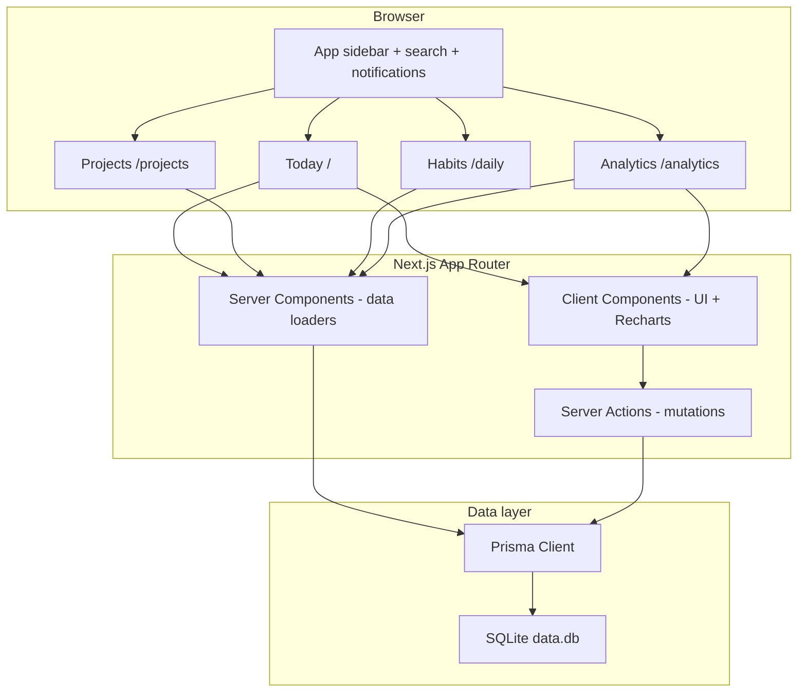
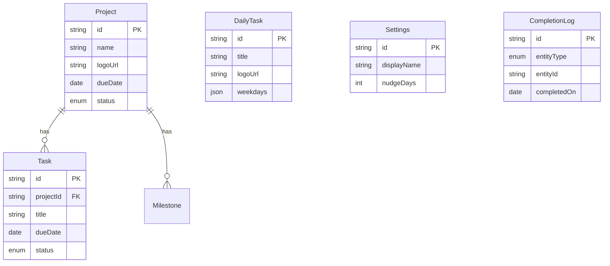

# Architecture

Technical design of DailyHub.

## High-level diagram



## Request flow

### Read (Today)

1. `src/app/(app)/page.tsx` calls `getDashboardData()`
2. Parallel Prisma queries: projects+tasks, scheduled daily tasks, inbox, stats, notifications input
3. Data passed to client `DashboardShell` with URL-based project filter

### Read (projects / daily)

1. `/projects` calls `getProjectsPageData()` — all projects with open task counts
2. `/daily` calls `getDailyPageData()` — all daily tasks with weekday schedules

### Read (analytics)

1. `src/app/(app)/analytics/page.tsx` calls `getAnalyticsData()` in `src/lib/analytics.ts`
2. Aggregates completions, task counts, project stats, weekday-aware daily habit rates
3. Passed to `AnalyticsShell` with Recharts client components

### Write (mutations)

1. Client form/button invokes Server Action in `src/app/actions/`
2. Zod validation via `src/lib/validations.ts`
3. Prisma write (often `$transaction` for task complete + completion log)
4. `revalidatePath` for `/`, `/projects`, `/daily`, `/analytics`
5. Failures return `{ success: false, error }` via `failAction()` instead of throwing

## Route groups

```
src/app/
├── layout.tsx              # Instrument Sans / Doto / Geist Mono, ThemeProvider
├── not-found.tsx
├── global-error.tsx
├── uploads/[filename]/     # Serves DAILYHUB_DATA_DIR/uploads
└── (app)/
    ├── layout.tsx          # AppShell: sidebar, search, notifications
    ├── error.tsx
    ├── loading.tsx
    ├── page.tsx            # Today (/)
    ├── projects/page.tsx
    ├── daily/page.tsx
    └── analytics/page.tsx
```

`(app)` is a route group — URLs remain flat (`/`, `/projects`, etc.).

## Data model



### Completion semantics

| Action | Task row | CompletionLog |
|--------|----------|---------------|
| Complete ad-hoc/project task | `status = DONE`, `completedAt` set | New row `entityType=TASK` |
| Toggle daily task (on) | — | New row `entityType=DAILY_TASK`, `completedOn=today` |
| Toggle daily task (off) | — | Delete today's log for that daily task |

`CompletionLog` uses a unique constraint on `(entityType, entityId, completedOn)` for daily habits.

Daily tasks only appear on Today when `weekdays` includes today's JS `getDay()` value.

## Key libraries

| Library | Usage |
|---------|--------|
| `motion` | Page/card stagger, checklist animations |
| `recharts` | Analytics bar charts + compact Today chart |
| `date-fns` | Formatting, week boundaries, date ranges, overdue checks |
| `zod` | Server Action input validation |
| `lucide-react` | Icons via `iconKey` string lookup |

## File upload

- Server Action: `src/app/actions/upload.ts`
- Detection/sanitization: `src/lib/uploaded-image.ts` (magic-byte sniff; SVG allowlist sanitize)
- Writes to `DAILYHUB_DATA_DIR/uploads/` with UUID filename
- Max 2MB; PNG, JPG, WEBP, SVG (sanitized)
- Served via `src/app/uploads/[filename]/route.ts` at `/uploads/{uuid}.{ext}`
- SVG responses include `nosniff` and a sandboxed document CSP

Remote `https?://` logo URLs are stored on `Project.logoUrl` / `DailyTask.logoUrl` and rendered as `` only.

### Logo colour extraction

A project's accent colour is derived from its logo **in the browser**: the image is read as a `data:` URL, drawn into a 64×64 canvas, and the pixels are ranked by `src/lib/logo-color.ts`, which drops background/near-neutral pixels, merges perceptually-close shades, and takes the cluster that scores highest as the logo's mark (vivid, mid-toned, and present in quantity). There is no server-side image decoding and no image dependency (`sharp` and friends are deliberately absent).

The derived colour is only a starting point. `src/components/ui/color-field.tsx` always offers a manual override — the palette, the OS colour picker, a typed hex, or `LogoPixelPicker`, which re-draws the same `data:` URL onto a board and lets the user click the exact pixel they want (with a nearest-neighbour loupe, arrow-key nudging, and transparent pixels rejected). A manual pick sets `colorSource = "manual"`, which stops later logo changes from overwriting it; "Reset to auto" hands the colour back to extraction.

Two constraints shape this:

- The CSP allows `img-src 'self' data: https:` but **not** `blob:`, so uploaded files go through `FileReader` rather than `URL.createObjectURL`.
- Images are awaited through the `load` event, never `img.decode()`. `decode()` never settles while a page is hidden — Chromium defers decoding for anything it cannot paint — which would hang the backfill in a background tab and the pixel picker's loupe in a tab the user switched away from.
- A canvas cannot read a cross-origin image, so remote logo URLs are fetched by `src/app/actions/logo-color.ts` and re-emitted same-origin as a `data:` URL. That action is only a CORS proxy — it reuses `detectUploadedImage()` for sniffing and SVG sanitization, caps the body at 2MB, and times out after 5s.

#### Backfilling databases that pre-date colours

Because extraction needs a canvas, a migration cannot fill colours in for projects that already exist — so a one-time pass runs in the browser instead. `getPendingLogoColors()` lists projects with a logo, no colour, and `colorSource = "auto"`; `LogoColorBackfill` (mounted in the app layout) walks them on idle through the same extraction path the project dialog uses and posts the results back in one call. `Settings.logoColorsBackfilledAt` is then stamped — even when nothing could be extracted, so a logo that yields no colour is not re-decoded on every page load forever.

Two details in `src/lib/logo-color-backfill.ts` matter more than they look:

- The write is raw SQL. `Project.updatedAt` carries `@updatedAt`, and projects are ordered by it on the dashboard, so writing through Prisma would restamp every backfilled row and silently reshuffle Today on the first launch after an upgrade.
- The `color IS NULL AND colorSource = 'auto'` guard lives in the statement, not just in the query that picked the candidates, so a colour the user chose cannot be overwritten by a stale client.

## Docker services

| Service | Image / build | Port | Role |
|---------|---------------|------|------|
| `app` | `baselhusam/daily-hub` (or local `Dockerfile`) | 9999 | App + SQLite + auto migrate |

Volume: `dailyhub_data` → `/app/data` (`data.db` + `uploads/`).

## Security headers

`next.config.ts` sets CSP, `X-Content-Type-Options`, `X-Frame-Options`, and `Referrer-Policy` on all routes.

## Performance notes

- Today and analytics pages use `export const dynamic = 'force-dynamic'`
- Analytics queries are bounded (14-day window, 7-day daily stats)
- Prisma client singleton in `src/lib/prisma.ts` (dev hot-reload safe)
- SQLite runs with WAL mode, `busy_timeout`, and foreign keys enabled at startup
