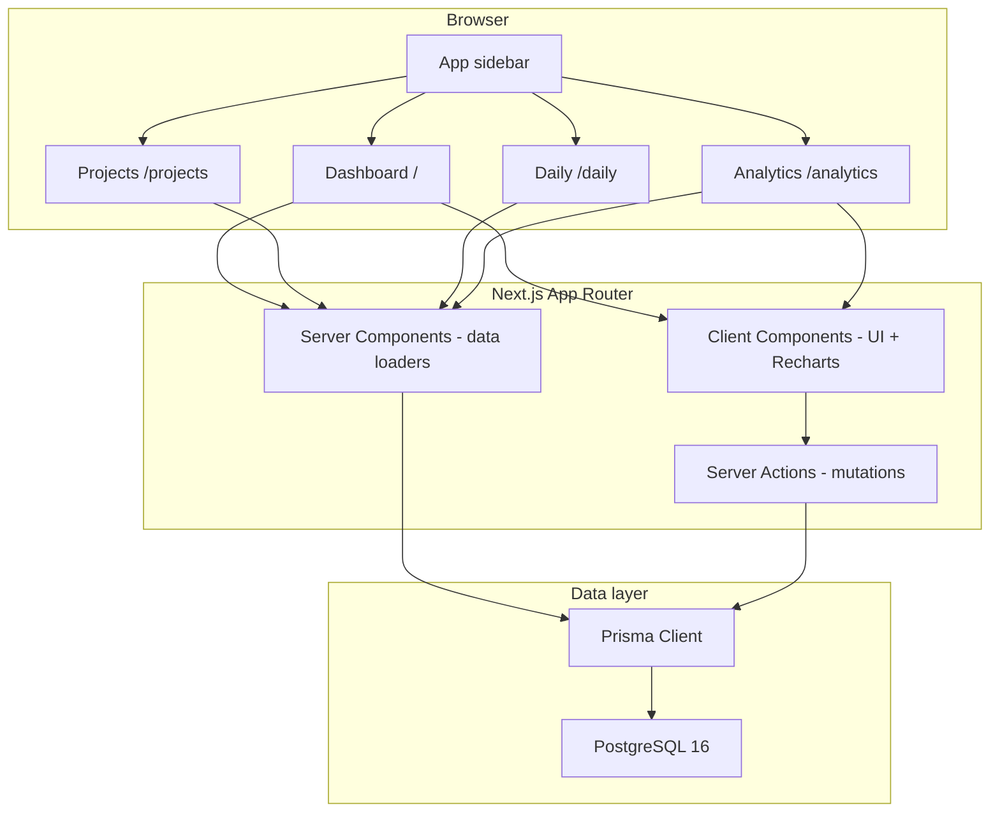
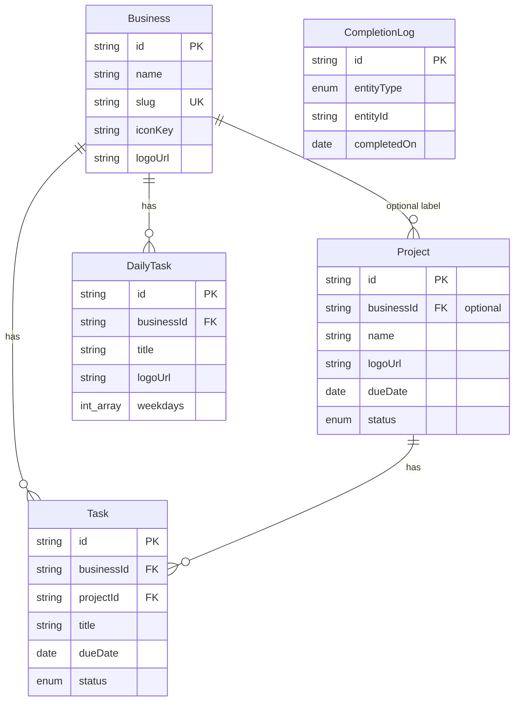

# Architecture

Technical design of DailyHub.

## High-level diagram



## Request flow

### Read (dashboard)

1. `src/app/(app)/page.tsx` calls `getDashboardData()` and `getAnalyticsData()` (chart subset)
2. Parallel Prisma queries: businesses, projects+tasks, scheduled daily tasks, inbox, stats
3. Data passed to client `DashboardShell` with URL-based project filter

### Read (projects / daily)

1. `/projects` calls `getProjectsPageData()` — all projects with business + open task counts
2. `/daily` calls `getDailyPageData()` — all daily tasks with weekday schedules

### Read (analytics)

1. `src/app/(app)/analytics/page.tsx` calls `getAnalyticsData()` in `src/lib/analytics.ts`
2. Aggregates completions, task counts, business/project stats, weekday-aware daily habit rates
3. Passed to `AnalyticsShell` with Recharts client components

### Write (mutations)

1. Client form/button invokes Server Action in `src/app/actions/`
2. Zod validation via `src/lib/validations.ts`
3. Prisma write (often `$transaction` for task complete + completion log)
4. `revalidatePath` for `/`, `/projects`, `/daily`, `/analytics`

## Route groups

```
src/app/
├── layout.tsx           # Root: Geist fonts, ThemeProvider
└── (app)/
    ├── layout.tsx       # AppSidebar + MobileNav + main
    ├── page.tsx         # Dashboard
    ├── projects/
    │   └── page.tsx     # Projects management
    ├── daily/
    │   └── page.tsx     # Daily habit management
    └── analytics/
        └── page.tsx     # Analytics
```

`(app)` is a route group — URLs remain flat (`/`, `/projects`, etc.).

## Data model



### Completion semantics

| Action | Task row | CompletionLog |
|--------|----------|---------------|
| Complete ad-hoc/project task | `status = DONE`, `completedAt` set | New row `entityType=TASK` |
| Toggle daily task (on) | — | New row `entityType=DAILY_TASK`, `completedOn=today` |
| Toggle daily task (off) | — | Delete today's log for that daily task |

`CompletionLog` uses a unique constraint on `(entityType, entityId, completedOn)` for daily habits.

Daily tasks only appear on the dashboard when `weekdays` includes today's JS `getDay()` value.

## Key libraries

| Library | Usage |
|---------|--------|
| `motion` | Page/card stagger, checklist animations |
| `recharts` | Analytics bar charts + compact dashboard chart |
| `date-fns` | Formatting, week boundaries, date ranges, overdue checks |
| `zod` | Server Action input validation |
| `lucide-react` | Icons via `iconKey` string lookup |

## File upload

- Server Action: `src/app/actions/upload.ts`
- Writes to `public/uploads/` with UUID filename
- Max 2MB; PNG, JPG, WEBP, SVG
- Returns path like `/uploads/{uuid}.png` stored on `Business.logoUrl`, `Project.logoUrl`, or `DailyTask.logoUrl`

## Docker services

| Service | Image / build | Port | Role |
|---------|---------------|------|------|
| `db` | `postgres:16-alpine` | 5432 | Persistent Postgres |
| `app` | `Dockerfile` (standalone Next) | 9999 | App + auto migrate |

Volumes: `postgres_data`, `uploads_data`.

## Performance notes

- Dashboard and analytics pages use `export const dynamic = 'force-dynamic'`
- Analytics queries are bounded (14-day window, 7-day daily stats)
- Prisma client singleton in `src/lib/prisma.ts` (dev hot-reload safe)
